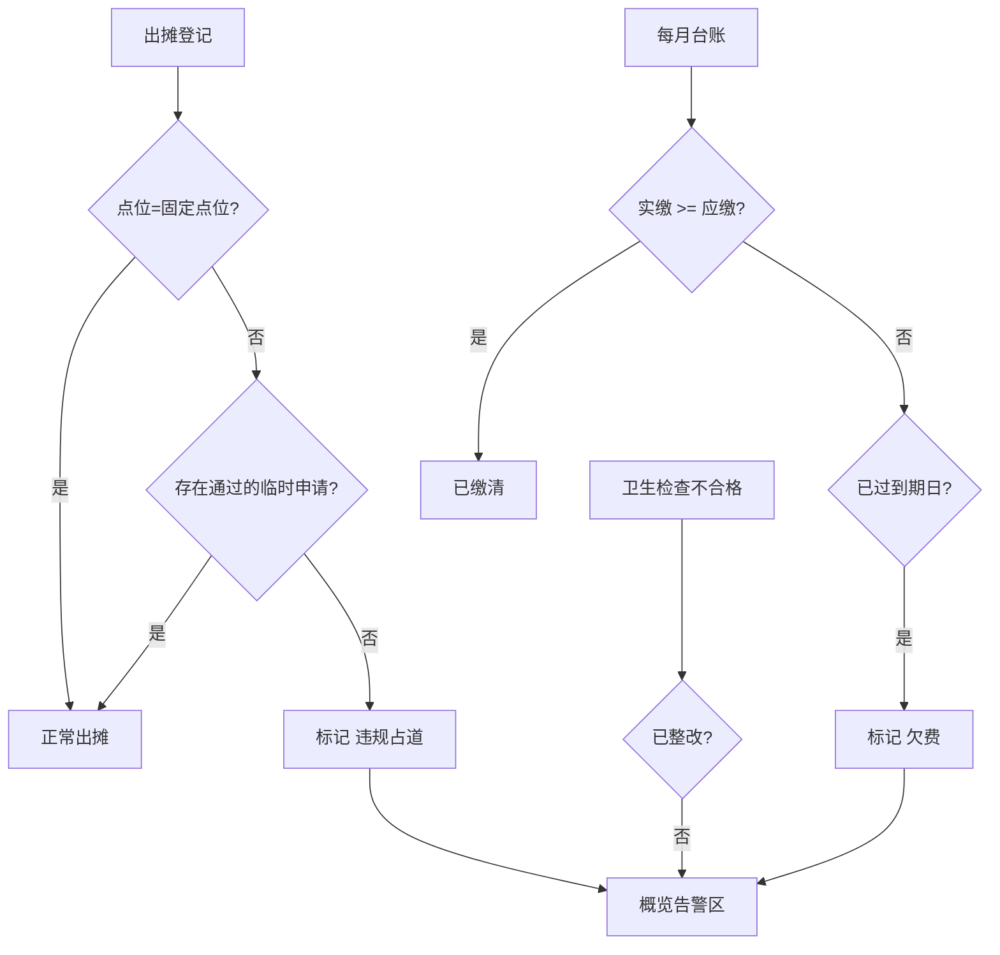

# 晨光摊位 — 早餐车/移动摊位管理系统 产品需求文档（PRD）

## 1. 产品概述
「晨光摊位」是一套面向城市街头早餐车与移动摊位的轻量级运营管理系统，帮助摊主与街区管理员在一个工作台内完成点位、出摊、进货、记账、卫生与摊位费的全流程管理。
核心解决三类痛点：① 摊位信息分散、点位与申请难以追踪；② 现金与扫码流水混记、对账繁琐；③ 卫生违规、占道、欠费状态无法一目了然。目标用户为街区管理员与个体摊主，价值在于把"一张纸质登记表"升级为"一块可交互的数字看板"。

## 2. 核心功能

### 2.1 用户角色
| 角色 | 登记方式 | 核心权限 |
|------|----------|----------|
| 街区管理员 | 系统预设账号 | 全部模块的增删改查、审核临时申请、标记违规 |
| 摊主 | 关联摊位号 | 查看自身点位/出摊/缴费状态、登记出摊与流水 |

> 本期为演示版本，默认以管理员视角操作，角色切换不展开实现，但数据结构预留摊主字段。

### 2.2 功能模块
1. **概览仪表盘**：关键运营指标、今日告警（违规占道/欠费）、今日出摊一览、近期流水趋势。
2. **出摊点位管理**：固定点位列表 + 临时申请审核，含点位编号、地址、容纳摊位数、状态。
3. **每日出摊登记**：按日期登记摊位号、出摊时段、经营品类、所在点位。
4. **食材进货记录**：供应商、品名、数量、金额、进货日期，支持按摊主/日期筛选。
5. **流水记账**：现金与扫码两类支付方式流水，含金额、时间、品类、备注，支持日汇总。
6. **卫生检查记录**：检查日期、检查项、结果（合格/警告/不合格）、扣分、整改状态。
7. **摊位费缴纳**：按月度缴费台账，缴费状态、应缴/实缴、到期日，欠费自动标记。

### 2.3 页面详情
| 页面名称 | 模块名称 | 功能描述 |
|----------|----------|----------|
| 概览仪表盘 | 指标卡 | 在册点位数、今日出摊数、本月流水、待整改项等关键指标 |
| 概览仪表盘 | 告警区 | 自动标记违规占道、未缴摊位费、卫生不合格项，可点击跳转 |
| 概览仪表盘 | 今日出摊 | 今日已登记摊位的时间/品类/点位快览 |
| 概览仪表盘 | 流水趋势 | 近 7 日现金/扫码流水柱状趋势 |
| 点位管理 | 固定点位 | 卡片式点位列表，显示编号、地址、摊位数、占用状态 |
| 点位管理 | 临时申请 | 申请列表与审核（通过/驳回），含申请时段与理由 |
| 出摊登记 | 登记表 | 表单：日期、摊位号、点位、时段、经营品类；下方今日登记列表 |
| 食材进货 | 进货台账 | 表格列示供应商/品名/数量/金额/日期，支持新增与筛选 |
| 流水记账 | 流水台账 | 表格列示金额/支付方式/品类/时间，顶部日汇总（现金/扫码/合计） |
| 卫生检查 | 检查台账 | 表格列示日期/摊位/检查项/结果/扣分/整改状态，不合格高亮 |
| 摊位费 | 缴费台账 | 按月度摊位号展示应缴/实缴/状态/到期日，欠费自动红色标记 |

## 3. 核心流程

### 3.1 每日出摊与记账流程
摊主在「出摊登记」选择当日点位与时段完成登记 → 经营过程中在「流水记账」逐笔记录现金/扫码流水 → 管理员在「概览」查看当日全街区出摊与流水汇总。

### 3.2 违规与欠费自动标记流程
系统在「概览」与各台账页根据规则自动计算标记：
- **违规占道**：出摊登记所选点位非其固定点位、且无对应"通过"的临时申请 → 标记"违规占道"。
- **未缴摊位费**：当前月份台账中实缴 < 应缴且已过到期日 → 标记"欠费"。
- **卫生不合格**：最近一次检查结果为"不合格"且未整改 → 在概览告警区展示。

## 4. 用户界面设计

### 4.1 设计风格
- **风格定位**：晨光市集（Morning Market）— 温暖、编辑感、像一张手写市集布告板。融合 kraft 牛皮纸的质朴与晨曦暖光的温度，避开冷冰冰的 SaaS 蓝紫。
- **主色**：陶土橘 `#C75B39`（陶器/晨光），辅色 暖墨黑 `#1F1A17`、米浆底 `#F6F1E7`。
- **状态色**：橄榄绿 `#5C7A3A`（合格/已缴）、深朱 `#A52A1C`（违规/欠费）、暖琥珀 `#C7882A`（待审/警告）。
- **字体**：标题用 `ZCOOL XiaoWei`（带笔意的中文展示字）+ `Fraunces`（拉丁/数字衬线，编辑感）；正文用 `Noto Sans SC`。
- **组件**：圆角卡片（`rounded-xl`）、细描边、轻微投影；状态用"印章式"徽章（带轻微旋转的边框徽章）。
- **图标**：`lucide-react` 线性图标，与陶土橘搭配。
- **布局**：桌面优先，左侧固定侧边栏导航 + 顶部页面标题，主内容区卡片网格与数据表交替。

### 4.2 页面设计概览
| 页面名称 | 模块名称 | UI 元素 |
|----------|----------|----------|
| 概览仪表盘 | 指标卡 | 大号 Fraunces 数字 + 暖墨小标，4 列网格 |
| 概览仪表盘 | 告警区 | 印章式红色徽章列表，hover 升起阴影 |
| 概览仪表盘 | 流水趋势 | CSS 柱状图（双柱 现金/扫码），暖色调 |
| 点位管理 | 固定点位卡 | kraft 卡片，左色块状态条，占用率进度条 |
| 出摊登记 | 登记表 | 左表单右列表，时段多选 chips |
| 流水记账 | 日汇总 | 顶部三联汇总卡（现金/扫码/合计），下方流水表 |
| 摊位费 | 缴费台账 | 表格行，欠费行整行淡红底 + 印章徽章 |

### 4.3 响应式
桌面优先（≥1024px 最佳），平板/移动端侧边栏折叠为顶部抽屉，数据表横向滚动，指标卡自适应为单列。

### 4.4 3D 场景
不适用（本期为纯数据看板）。
