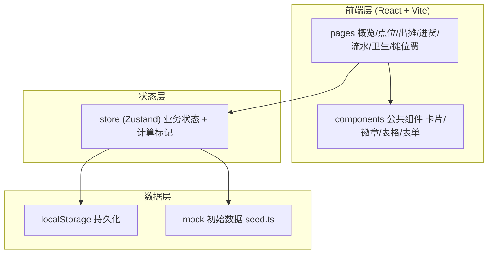
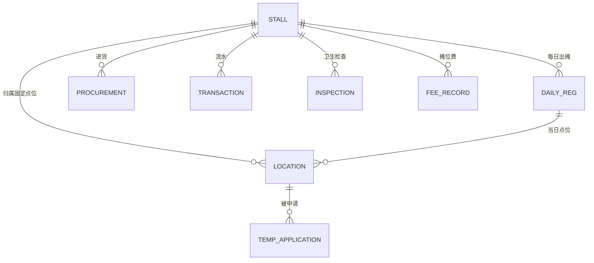

# 晨光摊位 — 技术架构文档

## 1. 架构设计
本期为纯前端演示应用（无后端服务），数据使用 Zustand + localStorage 持久化，启动时注入 mock 初始数据。



## 2. 技术说明
- **前端**：React@18 + TypeScript + TailwindCSS@3 + Vite
- **初始化工具**：vite-init（react-ts 模板）
- **路由**：react-router-dom v6
- **状态管理**：zustand（含 persist 中间件持久化到 localStorage）
- **图标**：lucide-react
- **字体**：ZCOOL XiaoWei + Fraunces + Noto Sans SC（Google Fonts）
- **后端/数据库**：无（本期纯前端，mock 数据）

## 3. 路由定义
| 路由 | 用途 |
|------|------|
| `/` | 概览仪表盘 |
| `/locations` | 出摊点位管理（固定点位/临时申请） |
| /daily-ops | 每日出摊登记 |
| /procurement | 食材进货记录 |
| /transactions | 流水记账（现金+扫码） |
| /inspections | 卫生检查记录 |
| /fees | 摊位费缴纳状态 |

## 4. 数据模型

### 4.1 数据模型定义


### 4.2 数据定义
```ts
// 摊位（摊主）
interface Stall {
  id: string;            // ST-001
  name: string;          // 摊主姓名
  stallNo: string;       // 车牌/摊位号
  category: string;      // 经营品类
  locationId: string;    // 固定点位 id
  phone?: string;
}

// 点位
interface Location {
  id: string;            // L-001
  code: string;          // 点位编号
  address: string;       // 地址
  capacity: number;      // 容纳摊位数
  type: 'fixed' | 'temporary';
  active: boolean;
}

// 临时申请
interface TempApplication {
  id: string;
  stallId: string;
  locationId: string;
  date: string;          // 申请日期
  timeSlot: string;      // 时段
  reason: string;
  status: 'pending' | 'approved' | 'rejected';
  createdAt: string;
}

// 每日出摊登记
interface DailyRegistration {
  id: string;
  stallId: string;
  locationId: string;    // 当日点位（可能为临时）
  date: string;
  timeSlots: string[];   // 出摊时段
  categories: string[];   // 经营品类（可多个）
  note?: string;
}

// 食材进货
interface Procurement {
  id: string;
  stallId: string;
  supplier: string;
  item: string;
  quantity: string;
  unit: string;
  amount: number;
  date: string;
}

// 流水记账
interface Transaction {
  id: string;
  stallId: string;
  amount: number;
  method: 'cash' | 'scan';   // 现金/扫码
  category: string;
  time: string;
  note?: string;
}

// 卫生检查
interface Inspection {
  id: string;
  stallId: string;
  date: string;
  items: { name: string; pass: boolean }[];
  result: 'pass' | 'warning' | 'fail';
  deduction: number;
  rectified: boolean;
  inspector: string;
}

// 摊位费
interface FeeRecord {
  id: string;
  stallId: string;
  period: string;        // 2026-06
  dueAmount: number;     // 应缴
  paidAmount: number;    // 实缴
  dueDate: string;       // 到期日
  status: 'paid' | 'partial' | 'unpaid';
  paidAt?: string;
}
```

## 5. 自动标记规则（核心业务逻辑）
集中放在 `src/store/` 的计算逻辑中：
- `isIllegalOccupation(reg)`：reg.locationId !== stall.locationId 且不存在 status=approved 且 date 匹配的 TempApplication。
- `isOverdueFee(fee)`：paidAmount < dueAmount 且 today > dueDate。
- `hasOpenInspection(stallId)`：最新 Inspection 结果为 fail 且 rectified=false。

## 6. 项目结构
```
src/
  components/      公共组件（StatCard, Badge, DataTable, Modal, Sidebar...）
  pages/           各业务页面
  store/           zustand store + 业务计算逻辑
  data/            seed.ts mock 初始数据
  utils/           工具函数（日期/金额格式化/标记计算）
  types.ts         全局类型定义
  App.tsx          路由与布局
  main.tsx         入口
  index.css        tailwind + 字体 + 全局样式
```
